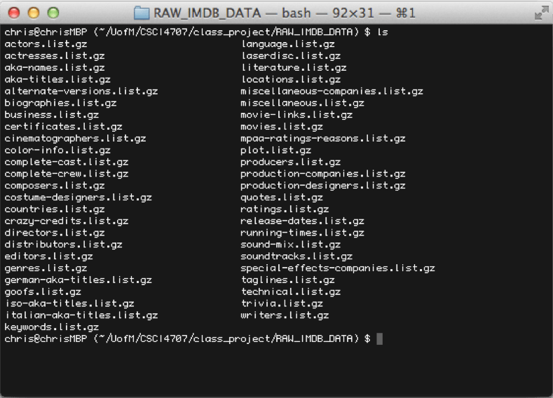
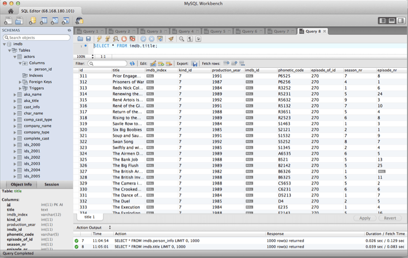
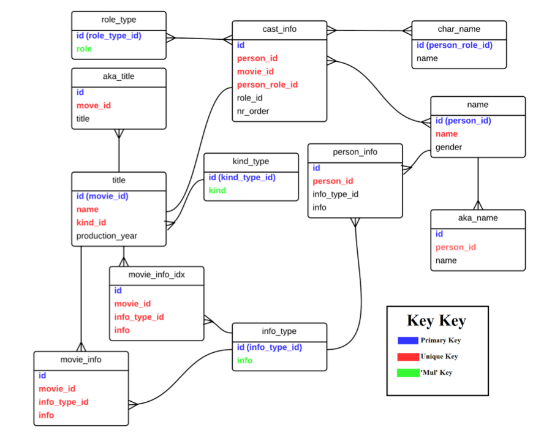
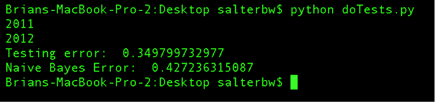
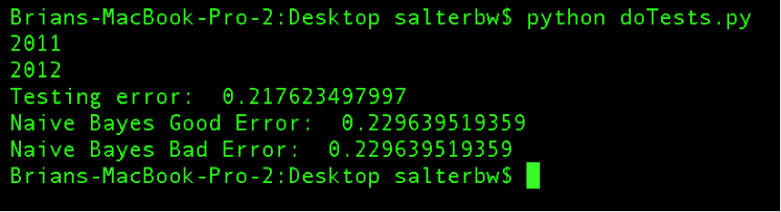

This Spring I worked with Brian Salter and Rich Jeffery to complete a semester long project using relational databases to predict upcoming movie outcomes. We wanted to do something with an exceedingly large amount of data, just for fun - and decided that movies were a good example of something with large amounts of data that would fit well in relations. 
 <!--more-->

We came up with a motivation for our research:

<h4 style="padding-left: 30px;"><strong>Using existing data on past movies and available data on upcoming movies, can we accurately predict how well upcoming movies will do?</strong></h4>

More specifically, using metrics of past movies such as cast, director, release date, rating, duration, subject matter, etc, can we accurately predict whether a movie will be 'good' or 'bad' (perhaps measure in ratings, box office sales, etc)? What patterns in these metrics would ensure a quality prediction?

For our data, we used what anyone would expect us to use: the <a href="http://imdb.com" target="_blank">Internet Movie Database.</a> From the packaged <a href="http://www.imdb.com/interfaces" target="_blank">text data dumps</a> that IMDb provides, we used an open source Python project called <a href="http://imdbpy.sourceforge.net/" target="_blank">IMDbpy</a> to extract all of the information and store it in our database. The IMDb user review score is the value we used as the criteria for a good movie.

We evaluated the data concerning movies released between 2000 and 2010 in an attempt to train a <a href="http://en.wikipedia.org/wiki/Perceptron" target="_blank">perceptron</a> (a classification model), and to use the perceptron to predict the IMDb user review score of new movies based on the chosen metrics.

<strong>TL;DR: We were able to get a classifier working with an accuracy rate of over 60%, and ~80% with the threshold rating increased. It's an interesting project that we are considering improving on this summer and building some sort of hosted web app. Brian has started a GitHub project called <a href="https://github.com/salterbw/PUMA" target="_blank">PUMA (Probably &Uuml;ber Movie Advice)</a> where you can see our classifier in action.</strong>

<h3>Importing the Data</h3>

IMDb is an exceedingly large database &ndash; getting all of the data into a database for our analysis was a bit of a challenge.&nbsp; The methods for processing the data and the very database implementation itself had to be changed from our original plan due to the sheer amount of data being handled and stored.

To begin with, we considered using a RESTful web API called <a href="http://www.imdbapi.org" target="_blank">IMDB API</a> to retrieve data. This plan was determined to be quite a hassle, as processing would take an extraordinary amount of time and bandwidth and IMDB API limits the amount of requests to 3,000 per hour. The only way to describe this would be &lsquo;unfortunate&rsquo;, as there are 4,115,950 entries in our table containing persons within our final database structure. That would be over 57 days of data processing for one of our 22 tables. Instead we discovered that IMDb distributes subsets of plain text data files from their website on their Alternative Interfaces page.&nbsp; The 49 unique data files require 6.75GB of plain text when uncompressed.

To process the enormous plain text files, we used an open source project called <a href="http://imdbpy.sourceforge.net" target="_blank">IMDbPY.</a> The project is written entirely in Python (with a few lines of C!) and is released under the GPL license. It is primarily used as an API library for individual queries in Python, but also has a script (about 3,000 lines of code) for processing of IMDb&rsquo;s plain text files. The actual processing of data was time consuming and made us appreciate the intricacies and design choices of database structure and implementation. The many different retries in processing data led to many hours of downtime while processing occurred. These retries were largely due to some Python specific dependencies that needed to be fulfilled, but also due to some design choices that were forced upon us due to the nature of the data. The original proposal called for using Oracle database to house the data. As IMDbPY is open source, it was unsurprising to find that there was no support for Oracle (only SQLite, Postgres, and MySQL). It was proposed to process the data to SQLite, export to SQL statements, and import to Oracle. This option failed for two reasons.

First, although SQLite has large theoretical limits on database size (these limits are primarily determined by machine-specific computational limits more than anything else), we found processing usually crashed the local machine.&nbsp; After many attempts to export the database to SQL using various methods, we eventually gave up on SQLite and looked for alternative methods, which brought us to MySQL.

After successfully importing to MySQL, we encountered a second problem: Oracle has a table size limit of 4GB. The IMDb data exceeds this, and in order to properly join and create intermediate relations for our analysis, we needed more space.&nbsp; This was a sufficient enough reason for our project to remain in MySQL rather than transferring it to Oracle.

It took about 1.5 hours in the final run to process on a decent machine (AMD quad-core, 8GB DDR3). Lesson learned: Big data requires thoughtful planning and knowledge to set up and maintain effectively.

<h3>Understanding the Structure</h3>

Upon seeing the final product of our data import, the format of our database was slightly daunting, not to mention the sheer amount of &lsquo;useless&rsquo; data &ndash; data that was inconsequential to our analysis such as cinematographers, Disney Channel television shows, and aliases of makeup artists from documentaries. Every last detail about any one &lsquo;thing&rsquo; seemed to be hidden away in its own separate table. Many of the columns we needed to use for analysis were stored in three or four tables, due to the normal form of the database as a whole. The spread of the data was an attempt to normalize the data, as redundancy on a database this size would be incredibly wasteful and hard to maintain.

Additionally, some information was stored in the same table, but different rows, requiring some finesse with our queries. For example, budget was stored in movie_info with an info_type_id of 105 (this is the key that identifies which type of information is in the row), and release date was stored in the same table with an info_type_id of 16. We also wanted to limit our analysis to theatrical release which required a join with the title table (using kind_id which is a key for identifying the type of release a movie is). A greatly condensed map of the tables that we used is below. Due to the massive size of each table, we were forced to limit our analysis to about a decade&rsquo;s worth of data, considering only theatrical releases, and eliminating low budget films.

<strong>What if we just wanted to decide how good an actor is by examining the average scores of his movies?</strong>

A [very icky] nested query for this question looks like:

<pre><code>Select AVG(info) FROM (Select imdb.cast_info.movie_id, info, info_type_id, person_id, role_id FROM imdb.cast_info INNER JOIN imdb.movie_info_idx ON imdb.cast_info.movie_id = imdb.movie_info_idx.movie_id)  AS T WHERE (person_id = 1468525 AND (role_id = 1 or role_id = 2) AND info_type_id = 101);</code></pre>

Running this query takes upwards of 10 minutes and tells us that the late <a href="http://en.wikipedia.org/wiki/Rod_Steiger" target="_blank">Rod Steiger</a> has an average review score of 6.2.

<h3>Trimming the Data</h3>

As you can guess from the above query, one of the largest immediate problems we encountered when we began our attempt to classify the data was the time for analysis, mostly due to the size of each row vector.&nbsp; Each row represented a movie, and each column represented an actor who was possibly in the film.&nbsp; Rather than store a movie as a collection of person_ids (which could potentially affect analysis) we stored a movie as a series of binary variables.&nbsp; Each actor has a person_id which represented the column index.&nbsp; In each column was a binary variable which indicated whether they were in the movie (1) or not (0).&nbsp; There have been (according to the data on IMDb) ~2.7 million actors since the dawn of time.&nbsp; Thus, each row had ~2.7 million columns.&nbsp; This made analysis incredibly slow.

To increase the speed we had to remove some useless data. Most noticeable was the fact that the overwhelming majority of columns represented actors who starred in no movies during the ten year span we were looking at, making the entire matrix very sparse. We therefore had to do some pruning to limit how much data we were processing.

We next noticed two strange phenomena in the data.&nbsp; First, there were hundreds (if not thousands) of records for independent films, which generally starred actors with little weight that had never been in a feature film.&nbsp; To correct this, we attempted to filter the records further by budget, however budget was stored as a character string, so direct comparison to an arbitrary minimum budget wasn&rsquo;t possible.&nbsp; Instead we simply cut out all movies whose budget string was less than ten characters ($1,000,000).&nbsp; This removed most independent films.&nbsp; Second we noticed several movies appearing multiple times, which was causing them to appear multiple times in the actors database, which meant the thirty actors in a movie might appear three or four times for that same movie.&nbsp; For this, we simply ran several select distinct queries on the data to remove these duplicates as it seemed the only difference between them was release date. Maybe it was different geographic releases of the same film?

Once this was complete, we had managed to prune ~2.66 million columns off the data, and several thousand rows.&nbsp; This was met with a noticeable increase in processing speed when it came time to analyze the data again.

<h3>Predicting the Score</h3>

Once we had pulled all of the relevant data, we needed to train our classifiers.&nbsp; First we trained a perceptron to analyze the data.&nbsp; A perceptron is an algorithm that takes in a dataset and uses binary outputs to make predictions based on a linear prediction function.&nbsp; Because of this we had to arbitrarily choose a threshold by which to separate our data.&nbsp; We ran the perceptron using two different IMDB review scores as our metric for a &lsquo;good&rsquo; movie. We first looked at 6.5 stars then at 7 stars to evaluate the accuracy of the perceptron.&nbsp; The perceptron works by computing a weight vector.

If the dot product of the weight vector and the feature vector is greater than some threshold (0 in this case) we classify it as 1, else we classify as 0.&nbsp; The goal of the training phase of the perceptron algorithm is to learn what the weight vector should be to minimize training error (number of misclassified points / total number of points).&nbsp; This algorithm is guaranteed to converge on a set of weights which correctly classify all training points, however there is no time limit for this and as such our algorithm was not allowed to converge.

Secondly we attempted to train a na&iuml;ve Bayes classifier.&nbsp; This classifier works by using Bayes&rsquo;s theorem to compute the probability of a particular class given a set of features.&nbsp; This is effectively the same system used in spam detection (P(Spam|bunchawords)).&nbsp; The training of this model was the calculation of the probabilities P(Fi|C) where Fi is a particular feature (1 or 0) and C is a particular class (1 or 0).&nbsp;

Once both models were trained, we calculated prediction performance for both models.&nbsp; For the perceptron, we simply compute a set of dot products and compare the result according to the above formula.&nbsp; We counted the number of misclassified points and used this to determine error.&nbsp; For Na&iuml;ve Bayes we computed the formula below for each point:

In the 6.5 trials we tested only for the probability of the movie being good given the actor vector.&nbsp; For 7 we tested both P(Good|actors) and P(Bad|actors). Our results:

So we're on the right track! We were able to accurately predict whether a movie would be good or bad over 60% of the time.

We believe the error associated with the perceptron (testing error) is not a fully accurate measure of the system being better at 7 than 6.5.&nbsp; Because error is a function of misclassified points, and the probability of misclassification decreases as the boundary between good and bad increases, it becomes easier to predict as the boundary increases.&nbsp; That is, as we increase the boundary from 6.5 to 7, there are many more movies which count as bad than good.&nbsp; This results in it being easier to classify overall without the perceptron needing to be more intelligent.

<h3>Moving Forward</h3>

In the process of handling and manipulating the data, we had to make several large concessions.&nbsp; First, we had to limit our analysis to ten years to limit the matrix size.&nbsp; It is possible we could get better results looking through fifteen, twenty or even possibly thirty years of data.&nbsp; Secondly, we had to limit the number of features we looked at.&nbsp; Specifically, we only looked at actors within movies, but ignored features like writer, director, budget, time of year, rating and genre.&nbsp; We would like to use these additional metrics to learn better models.

Another large concession we had to make early on was to limit the complexity of our classifier.&nbsp; We had originally intended to attempt to predict actual star ratings rather than just good or bad based on an arbitrary value.&nbsp; This requires a multiclass perceptron which we haven't had time to build.&nbsp; We would also like to add layers to the perceptron, which would improve its ability to learn.

<h3>Credits</h3>

Much of this post has been snippets and excerpts of our group paper on the subject, and so due credit should be given to Rich and Brian. You can find Brian's site <a href="http://www.witty-url.com" target="_blank">here,</a> and don't forget to check out <a href="https://github.com/salterbw/PUMA" target="_blank">the continuation of this project on GitHub.</a>

