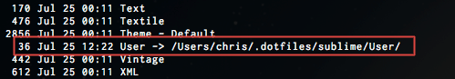

There are tons of people who save Sublime Text configuration files in GitHub repositories, and there are tons of people who keep a collection of dotfiles. Maybe it's the difference between Linux and Mac users, but there are <strong>not</strong> a lot of people who <em>have Sublime Text settings stored in their symlinked dotfiles.</em><!--more--> The distinction I make is this:

<ul>
<li>Most people that I've found with Sublime Text settings simply clone a 'sublime-text-settings' repository right over the top of the default directory.</li>
<li>Under a more Linuxy mindset, you'd have a repo of dotfiles which would contain your text editor settings and you'd create a symlink to have that program use those settings.</li>
</ul>

There are some exceptions, but the majority of dotfiles/Sublime Text collections that I've viewed either don't use Sublime Text or don't use dotfiles as they are usually organized. Why? I don't know. Maybe it's the distinction between old school Linux users with dotfiles refusing to leave vim and Mac users being unaware of the power and convenience of a widely-written-for Unix-like operating system and the use of a set of portable dotfiles. Whatever the reason, if you do use Sublime Text, be smart and use dotfiles as they're supposed to be used. I haven't found anyone who goes over it, so for anyone who needs a quick run through, here you go:

<h3>Setting up a dotfiles git repository with Sublime Text 2 settings (OSX)</h3>

First, a small aside. You need to install <a href="http://wbond.net/sublime_packages/package_control" target="_blank">Sublime Package Control</a>, a completely kick ass package manager for Sublime Text 2. Think of apt-get...er, Homebrew, for Sublime Text. You install it via the Sublime console.

<ol>
<li>Hit ctrl+`to open the console &nbsp; (That's a tilde)</li>
<li>Run the following command: 
<pre><code>import urllib2,os; pf='Package Control.sublime-package'; ipp=sublime.installed_packages_path(); os.makedirs(ipp) if not os.path.exists(ipp) else None; urllib2.install_opener(urllib2.build_opener(urllib2.ProxyHandler())); open(os.path.join(ipp,pf),'wb').write(urllib2.urlopen('http://sublime.wbond.net/'+pf.replace(' ','%20')).read()); print('Please restart Sublime Text to finish installation')</code></pre>
</li>
<li>Restart Sublime Text</li>
</ol>

Great. Now that you have that installed, all of the Sublime Text 2 user settings are stored in the Packages/User directory of the Sublime data folder. Make a new directory called .dotfiles, copy your existing User directory to .dotfiles, remove the Packages/User directory and replace it with a symlink to .dotfiles:

<ul>
<li>
<pre>mkdir -p ~/.dotfiles/sublime/</pre>
</li>
<li>
<pre>cp -r ~/Library/Application\ Support/Sublime\ Text\ 2/Packages/User ~/.dotfiles/sublime</pre>
</li>
<li>
<pre>rm -rf ~/Library/Application\ Support/Sublime\ Text\ 2/Packages/User</pre>
</li>
<li>
<pre>ln -s ~/.dotfiles/sublime/User/ ~/Library/Application\ Support/Sublime\ Text\ 2/Packages/User</pre>
</li>
</ul>

You're done. Listing your file details in the Packages directory should yield something like this:

If you're using GitHub, you could now create a repository and initialize the .dotfiles directory.

<ul>
<li>&lt;Create a GitHub repo&gt;</li>
<li>
<pre>cd ~/.dotfiles</pre>
</li>
<li>
<pre>git init</pre>
</li>
<li>&lt;Add files, create a commit&gt;</li>
<li>
<pre>git remote add origin https://github.com/&lt;username&gt;/&lt;repo&gt;.git</pre>
</li>
<li>
<pre>git push origin master</pre>
</li>
</ul>

Not hard.

&nbsp;

