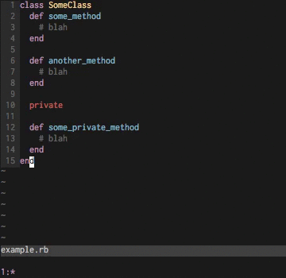
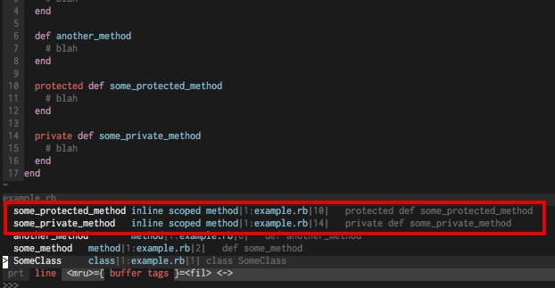

**TLDR: You can use [this](#solution) in your .ctags file to parse method definitions like
`private def method_name` in Ruby 2.1+**

Starting in Ruby 2.1, [defining a method returns the name of the method as a symbol][1], not just
`nil`. This was frequently suggested to be able to take advantage of fact that module methods like
`public`, `private` and `protected` can accept a symbol as an argument, allowing for the following
elegant-looking (or at least more commonly seen in other languages like C# or Java) code:

```ruby
  protected def some_protected_method
    # ...
  end

  private def some_private_method
    # ...
  end
```

At [Sport Ngin][4] we've been using a more explicit convention in declaring a method private after each
and every private method definition for some time:

```ruby
  def some_private_method
    # ...
  end
  private :some_private_method
```

There are many arguments for and against this and I won't go over it here. I personally prefer
the format you most commonly see with `private` and all of the private methods at the bottom of your
class, but I do think that the new syntax that Ruby 2.1+ allows is better than `private
:method_name` declarations - it's easier to see and saves a line every definition with less clutter.

We've since [changed our styleguide to use this new syntax][2], which I've started to call 'inline scoped
methods'.

## New syntax, old Ctags

I don't use [Ctags][5] for everything. With vim I usually navigate a project with various keybindings to
[CtrlP][6] and [The Silver Searcher][7] with combinations of grep/awk. What I do use frequently is CtrlP's
`CtrlPBufTag` command, which uses Ctags on the fly to jump to methods in the file you have open:



But Ctags, [having last been updated in July 2009][8], doesn't recognize this new inline scoped method
syntax. I dug in to figure out how to add this functionality. It turns out that adding options
and new parsings for Ctags is as simple as editing (or creating) `~/.ctags`

<a name="solution"></a>
## The Solution

It took me a bit as I'm _very_ unfamiliar with POSIX regular expressions, but the following addition
I wrote seems to work well:

```
--regex-ruby=/(^|;)[ \t]*(private|protected|public)(_class_method)?\(? def *(self.)?([[:alnum:]_]+)/\5/f,inline scoped method,inline scoped methods (Ruby 2.1+)/
```

This will match inline scoped definitions for private, protected, and public instance methods as
well as private class methods.




Even if you don't plan on using the new syntax afforded by Ruby 2.1+, I suggest that if you use
Ctags you add this functionality as if other people _do_ use it, you suddenly won't be able to
find these sorts of methods at all.

Misc:

* In digging into this issue I learned a ton about Ctags and what you can do with them. I consider
  myself fairly skilled at navigating a project quickly using the text searching tools mentioned
  earlier, but I certainly plan to dig in to Ctags more. They seem to have unlimited potential as a
  fully fledged project navigation tool. People who navigate _very_ large projects all the time seem
  to enjoy them...
  <blockquote class="twitter-tweet" lang="en"><p lang="en" dir="ltr">I don’t use NerdTree or fuzzy find because ctags and gf work really well.</p>&mdash; Aaron Patterson (@tenderlove) <a href="https://twitter.com/tenderlove/status/634472641752002560">August 20, 2015</a></blockquote>
  <script async src="//platform.twitter.com/widgets.js" charset="utf-8"></script>

* I also found a bunch of [other useful additions to Ctags][3], specifically for Rails developers.

* Lastly, I discovered a maintained successor to the original Exuberant Ctags, [Universal Ctags][9].
  As of this writing, I don't believe functionality for the syntax in this post has been added.

[1]: https://bugs.ruby-lang.org/projects/ruby-trunk/repository/revisions/42337
[2]: http://sportngin.github.io/styleguide/ruby.html#private--protected-methods
[3]: https://github.com/ChrisArcand/dotfiles/blob/master/ctags/ctags
[4]: http://www.codinginthecrease.com/
[5]: https://en.wikipedia.org/wiki/Ctags
[6]: http://kien.github.io/ctrlp.vim/
[7]: http://geoff.greer.fm/ag/
[8]: http://ctags.sourceforge.net/
[9]: https://github.com/universal-ctags/ctags
