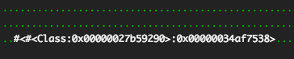
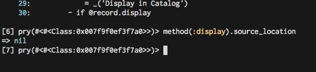
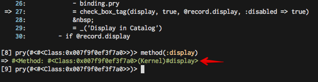
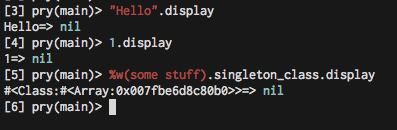

For the past many months on [ManageIQ][1] we've had a little phantom in our
test output. One time when I saw it appear, I whipped out my safari camera and
snapped a photo of this wild creature:



Whenever such phantom output appears in test output, 99% of my brain tells me
"Meh. Schweet. Whatever." The other 1% of my brain screams "YOU DARE RUIN THE
PRETTY GREEN DOTS?!"

We'd spend a few minutes to try and find it every now and then with no success.
We joked about it, thinking about who'd find it someday.

Programmatically finding something that writes to the output stream for your
screen can be easy and can be very difficult. I once tried doing the following:

```ruby
$stdout.singleton_class.send(:alias_method, :o_write, :write)

STDOUT_BLACKLIST = [
  /Class:0x/, # Our phantom
  # Other misc patterns I wanted to find:
  /may cause serious/,
  /Unrecognized arguments: port/,
  /there is already a transaction in progress/
]

class IO
  prepend Module.new {
    def write(*args)
      STDOUT_BLACKLIST.each do |pattern|
        if args.first =~ pattern
          $stdout.o_write("\n\nFOUND ONE!!!!!!!--->")
          $stdout.o_write("Here's the callstack:\n")
          caller.each do |line|
            $stdout.o_write("#{line}\n")
          end
          $stdout.o_write("\n")
          $stdout.flush
        end
      end
      super
    end
  }
end
```

This rather hacky code does a few things: First, it aliases the `write` method
on the singleton class of `$stdout`, a global variable in Ruby representing the
current standard output (an [`IO`][4] object). It then prepends a custom
`IO#write`, overriding the original method in the hierarchy to allow us to look
at the things being written to it, do something with it (such as send it to the
original standard output method, `o_write`...) and then call the original
`write` in the hierarchy.

Note that the prepend that I do here affects the `IO` class entirely - meaning
EVERY `IO` object, including ones that write to files, databases, etc is
affected. Don't do this unless you know what you're signing up for, is what I'm
saying.

As a [friend of mine][9] put when I showed him this:

> "I feel like IO is hardly used in computering. :-p"

I decided to do this because RSpec does some interesting redirection of output
and I was too lazy to track that down to the instance.

This code "works". It correctly found some of blacklisted patterns I assigned
above (some of them were gems outputting warning messages).

...except `#<#<Class:0x00000027b59290>:0x00000034af7538>`

What this tells us is that whatever is calling the thing outputting to the
screen, it's not being called within Ruby and is instead at the C level. No
native Ruby solution (that I know of) will find it. `/there is already a
transaction in progress/` is an obvious message from native Postgresql, and
that wasn't found either.

To continue the hunt we'd have to dig deeper with tools such as [DTrace][5].
I'm not very familiar with the tool and would love to dig in more fully some
day, but spending the effort just to find a random test output offender wasn't
exactly worth it at the time.

"Meh. Schweet. Whatever."

---

_Fast forward._ Yesterday as [Joe][2] and I were pairing on some very tedious changes to the
codebase and constantly starting long running test suites we decided to have a
go at our phantom again.

We cheated a little bit, in my mind. We knew from seeing it so often which type
of tests the output was coming from. Within a short time we had found the
offending test, a view spec, by using the `--documentation` formatter in RSpec.

With a little `puts` debugging we narrowed it down to a call to `render`. What
follows is a short read but took more time to truly understand than
I'd care to admit.

Digging in to the view being rendered, we found the offending line in the view
([HAML][3]):

```haml
= check_box_tag(display, true, @record.display, :disabled => true)
```

Mmmk. That's a call to [ActionView in Rails][6].

Let's look, do we do something awful and override this method somewhere in our app? Nope.

Where's `display` coming from, anyway? I don't see a reference to it in the code whatsoever.
What happens when we call `display` at that moment in time?


Huh. It prints the offending message to the screen and returns `nil`. But
really, where is `display` coming from? Why doesn't it throw an error if its
not defined?



Ah ha. As expected, this caller has to be at the C level as we thought.
[`source_location`][8] Returns the Ruby source filename and line number containing
this method or nil if this method was not defined in Ruby (i.e. native)

Well where the hell could `display` be coming from and why is the output obviously printing the current object we are-...




Oh.

**TIL: `Object`, the default root of all Ruby objects, has a [method called
`#display`][7] which prints the current object to the screen (in our context, some
anonymous object in ActionView testing).**

Some fun with IRB:




Something tells me it was not intended that this be the value for the `id` attribute in this particular check box :)

We later found out that this code was copied from somewhere else that defines its own `display` variable:

```ruby
- display = @record.set_data.key?(:display) ? @record.set_data[:display] : true
= check_box_tag(display, true, display, :disabled => true)
```

In our case, it should have been the string `"display"` but called `display`
instead, and by sheer coincidence the word `display` in any Ruby object is a
valid caller.

**"YOU DARE RUIN THE PRETTY GREEN DOTS?!"**

*Thanks to [Joe Rafaniello][2] for joining me on this fun little hunt!*

[1]: http://manageiq.org/
[2]: https://twitter.com/jrafanie
[3]: http://haml.info/
[4]: http://ruby-doc.org/core-2.3.1/IO.html
[5]: http://dtrace.org/blogs/about/
[6]: http://api.rubyonrails.org/v5.0.0/classes/ActionView.html
[7]: http://ruby-doc.org/core-2.3.1/Object.html#method-i-display
[8]: http://ruby-doc.org/core-2.3.1/Method.html#method-i-source_location
[9]: https://twitter.com/crsexton
