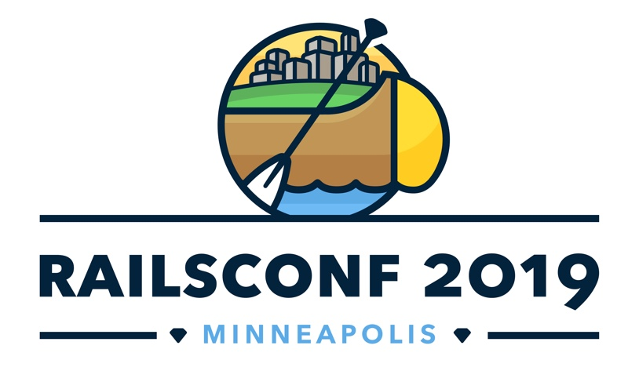
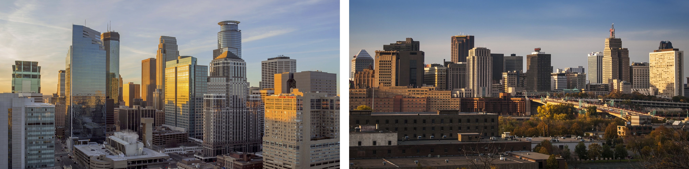
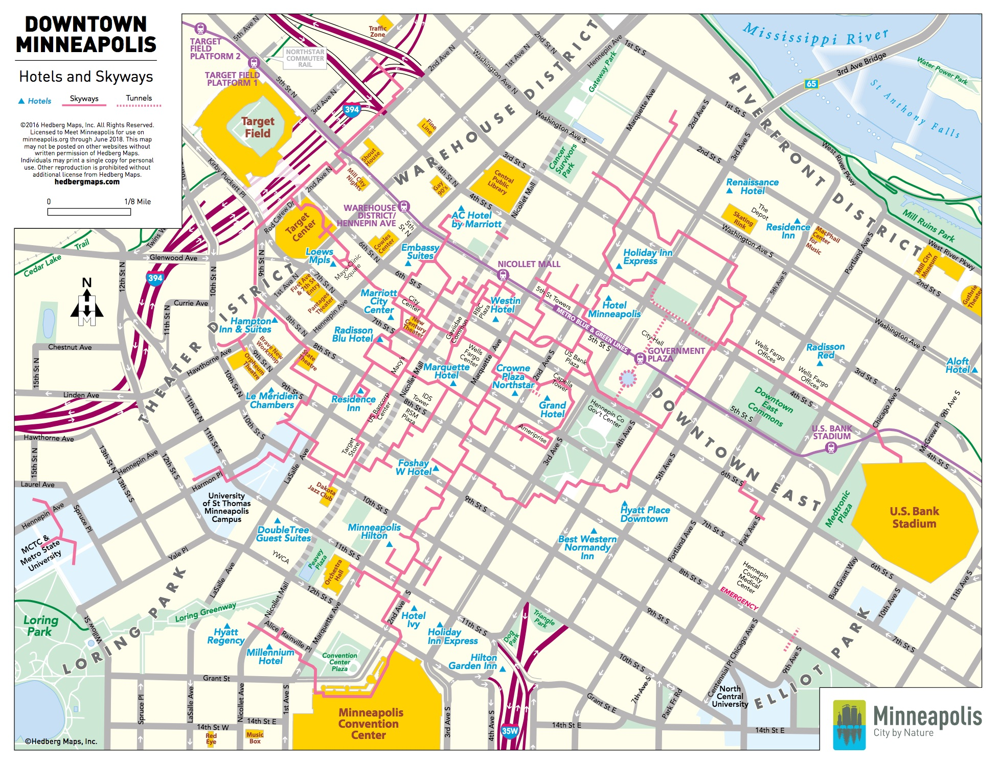
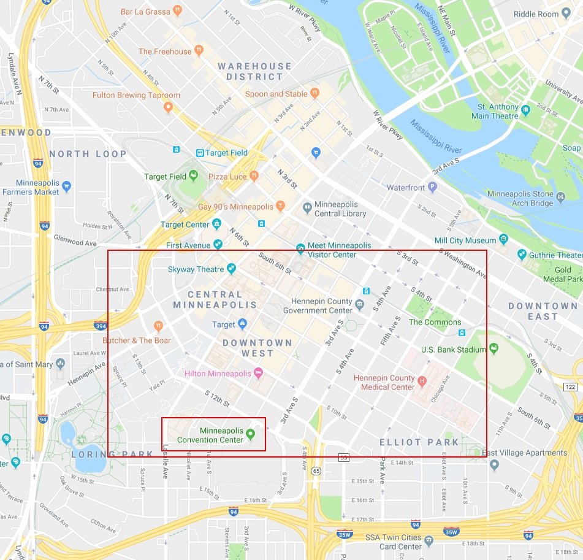
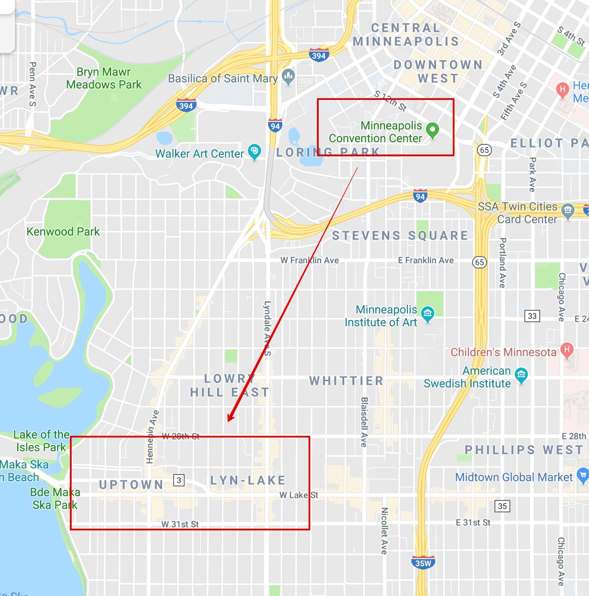
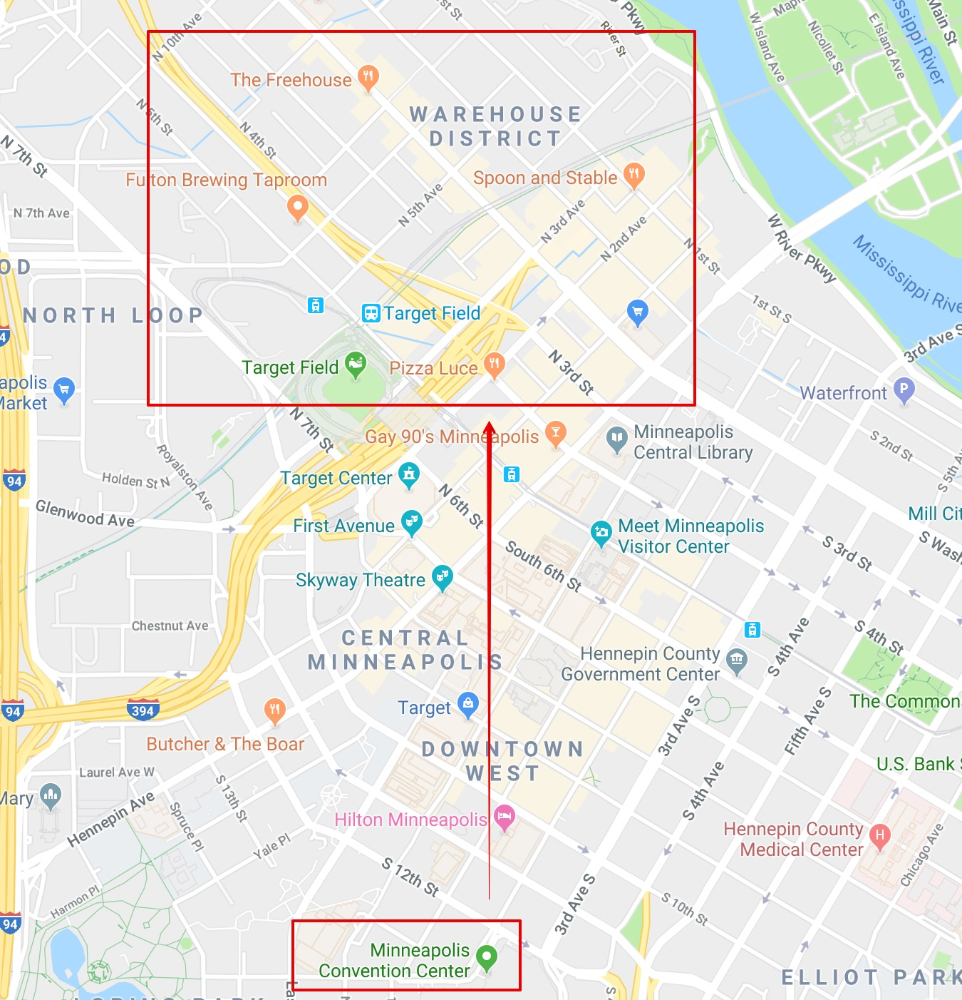
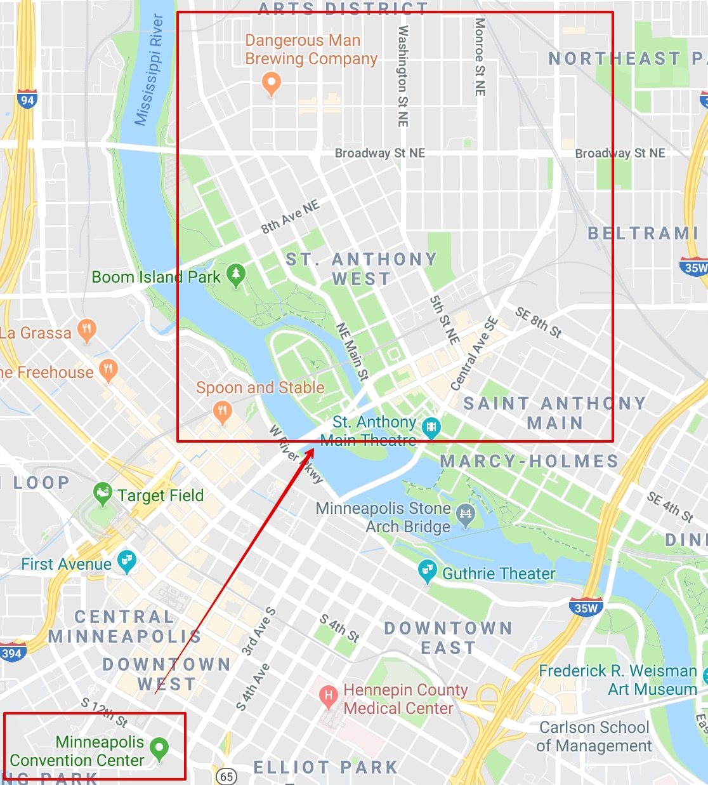
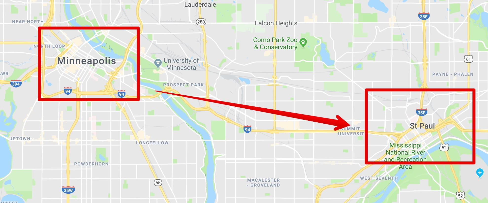

<meta name="twitter:card" content="summary" />
<meta name="twitter:site" content="@chrisarcand" />
<meta name="twitter:title" content="RailsConf 2019 Visitor's Guide to Minneapolis" />
<meta name="twitter:description" content="Visiting the Twin Cities for the first time? Wondering what to wear? Where's the good food and what's a 'Jucy Lucy'? Beer lover? I present to you the RailsConf 2019 Visitor's Guide to Minneapolis" />
<meta name="twitter:image" content="https://chrisarcand.com/images/posts/railsconflogo.jpg" />

RailsConf 2019 is here! No, really - here in Minneapolis, Minnesota! The
local Ruby community is thrilled to welcome you to our hometown.

Visiting the Twin Cities for the first time? Wondering what to wear? Where's
the good food and what's a "Jucy Lucy"? Beer lover? I present to you the
RailsConf 2019 Visitor's Guide to Minneapolis, created with love by myself,
Charles Nutter, and others at [RubyMN](http://ruby.mn/)!

* For up-to-date info on logistics concerning the conference itself (schedule, hotel,
  childcare, policies, etc) [the RailsConf website](https://railsconf.com/) is the definitive
  resource that you should reference.
* This page will likely continue to be updated throughout the conference with
  additional things as they come to mind or are contributed. Check back!

#### Quick Reference
<a class="anchor-only" href="#the-weather">The Weather/What to Wear</a>  
<a class="anchor-only" href="#skyway-map">Skyway Map</a>  
<a class="anchor-only" href="#places-to-eatdrink">Places to Eat</a>  
<a class="anchor-only" href="#vegetarianvegan-picks">Vegetarian/Vegan places to eat</a>  
<a class="anchor-only" href="#craft-beer">Craft Beer</a>  
<a class="anchor-only" href="#things-to-do">Things to Do</a>  

## Wait, 'Twin Cities'?

RailsConf 2019 is in [Minnesota](https://en.wikipedia.org/wiki/Minnesota)'s
largest city, [Minneapolis](https://en.wikipedia.org/wiki/Minneapolis)
(pictured left). Minnesota's capital city, [Saint
Paul](https://en.wikipedia.org/wiki/Saint_Paul,_Minnesota) (pictured right),
lies a mere 8 miles away (downtown to downtown). Together, the two cities
collectively create a single metro area - hence, the [Twin
Cities](https://en.wikipedia.org/wiki/Minneapolis%E2%80%93Saint_Paul).

Both cities have their own flavor and charm, and there's plenty to see and do
in both! This post focuses more on Minneapolis, where you'll be staying - but
remember that St. Paul is connected via the [Green
Line](https://www.metrotransit.org/metro-green-line) or it's a short
rideshare trip away.

## The Weather

I know, I know - you're worried about the weather. It _does_ get very cold
here, but the summers are quite lovely. Before we get to those summers,
however, Minnesota goes through what we like to call '2nd Winter' (aka
'spring'). It is currently 'spring'. 

Happy 'spring'.

After a week of beautiful sunny skies and ~75º (24ºC), we're regrettably
going to experience a temperature drop and rain during the conference. But
don't worry! I'm told the weather in the Convention Center is actually quite
temperate.

Are you worried about the previous weekend's forecast of..._snow?_ Don't.
It'll be gone or plowed (yes, we have plows!) before you get here. Really!
It's ok.

**"Soooo do I need to bring a jacket?"**  

Yup. But you don't need the world's heaviest winter jacket. The single
easiest way to be comfortably warm in cooler weather than you're used to is
by wearing a hat and gloves. So bring a light jacket and, if you think 40
degree (F, overnight) weather sounds super cold, a hat and some gloves.

## Skyway Map

  

It gets pretty cold here in the winter time. As such, Minnneapolis and St.
Paul both have extensive skyway systems: a giant string of enclosed
pedestrian foot bridges connecting downtown buildings, above street level. In
fact, the Minneapolis skyway system - which cover 80 city blocks spanning 11
miles (18 km) - is the longest contiguous system in the world.

The skyway conveniently connects the conference hotel to the conference
venue. However, if you're going for a longer stroll through downtown I
recommend to just go outside while you're visiting; it's much more enjoyable
and faster in most cases. It's definitely an option if you're feeling extra
chilly, though!

## Places to eat/drink

You're in the middle of the continent, as
[Midwest](https://en.wikipedia.org/wiki/Midwestern_United_States) as you can
get. The food has to be terrible here, right?

Wrong. The Twin Cities has some really great food. You'll find plenty of
local delicacies here in the Land of 10,000 Lakes, whether it's [Jucy
Lucies](https://en.wikipedia.org/wiki/Jucy_Lucy) (where we unabashedly take
credit for Wisconsin's cheese) or some
[walleye](https://en.wikipedia.org/wiki/Walleye#Cultural_aspects) from our
11,842 lakes (see what I did there?).

A true list of all the great places to eat would be impossible to fit on
here, but I'll throw in places by the conference hotel and some favorites all around.

### Around the conference hotel (Downtown)

There are *tons* of places to eat within walking distance of the conference hotel. This list is far from exhaustive.

* [**Hen House Eatery**](https://www.henhouseeatery.com/)  
   *114 S 8th St, Minneapolis, MN 55402*  
   Six blocks from the hotel. Cafe, great for breakfast/lunch.

* [**Hell's Kitchen**](https://www.hellskitcheninc.com/)  
   *80 South 9th St. Minneapolis, MN 55402*  
   Four blocks from the hotel. Also solid for breakfast.

* [**Brit's Pub**](https://britspub.com/)  
   *1110 Nicollet Mall, Minneapolis, MN 55403*  
   Two blocks from the hotel. Large UK-inspired pub/restaurant with a huge
   rooftop lawn bowling area (which regrettably probably isn't very useful
   while you're here in a Minnesotan April)

* [**Butcher & The Boar**](https://butcherandtheboar.com/)  
   *1121 Hennepin Ave, Minneapolis, MN 55403*  
   Popular American steak house, very meat-focused; excellent cocktails and
   bourbons, if that's your thing.

* [**The Local**](http://the-local.com/)  
   *931 Nicollet Mall, Minneapolis, MN 55402*  
   Multi-roomed Irish pub/restaurant, a long-time downtown staple.

* [**Zen Box Izakaya**](https://www.zenbox.com/)  
  *602 S Washington Ave, Minneapolis, MN 55415*  
  Japanese comfort food - ramen, small plates. A great lunch spot. It's a long walk from the hotel but a short bus ride/rideshare.
  Brings you right by the river with Stone Arch Bridge and Mill City ruins for great views of the city while you're here.

### Uptown (and Lyn-Lake)

_~10 minutes away via rideshare_

Uptown (at Hennepin and Lake), which is actually south of downtown, is one of
the more popular hang-out spots in the city. It's right next to Lyn-Lake (at - you
guessed it, Lyndale and Lake), and so although the most pedantic locals
would argue against it I've just grouped them in to one neighborhood here for you.

[Here's a great list of good picks for the area](http://mspmag.com/travel-and-visitors-guide/neighborhood-guides/best-of-uptown-restaurants-shops-and-more/#eat).

Some things I'd specifically like to call out:

* [**moto-i**](https://www.moto-i.com/)  
   *2940 Lyndale Ave S, Minneapolis, MN 55408*  
   The sole "craft sake" brewery in Minnesota.

* [**World Street Kitchen**](https://www.eatwsk.com/)  
   *2743 Lyndale Ave S #5, Minneapolis, MN 55408*  
   Brick-and-mortar version of a local food truck that makes "street foods from around the world."
   The Korean BBQ Bangkok burrito is life changing. And some of the Cities' best ice cream is right
   next door at [Milkjam Creamery](https://milkjamcreamery.com/).

* [**Blue Door, Lyn-Lake**](https://www.thebdp.com/)  
   *3006 Lyndale Ave S, Minneapolis, MN 55408*  
   A local pub favorite originally started in St. Paul with multiple locations.
   Lots of amazing burgers, including their own take on a Jucy Lucy: the 'Blucy'. 

* [**Chino Latino**](https://chinolatino.com/menu/)  
   *2916 Hennepin Ave S, Minneapolis, MN 55408*  
   "Street food from hot zones around the equator is how this restaurant
   describes its unique cuisine, served family-style. There's also a sushi
   bar and imaginative drink list, including the Chinopolitan, a cosmo
   garnished with dry ice." (Fodor travel review) Don't forget your outdoor
   voice if you go here.

* [**Volstead's Emporium**](https://www.volsteads.com/)  
   *"Secret" address*  
   The [National Prohibition
   Act](https://en.wikipedia.org/wiki/Volstead_Act), known informally as the
   Volstead Act, was enacted to carry out the intent of the 18th Amendment
   (ratified January 1919), which established prohibition in the United
   States. Its author? [Andrew Volstead](https://en.wikipedia.org/wiki/Andrew_Volstead),
   a member of Congress from Minnesota. Sorry about that. We corrected it
   [with the rest of y'all in
   1933](https://en.wikipedia.org/wiki/Twenty-first_Amendment_to_the_United_States_Constitution#Proposal_and_ratification)
   and then named an old [speakeasy](https://en.wikipedia.org/wiki/Speakeasy) after him out of spite. 

   The address literally is secret (sort of). You'll find it in an alleyway
   near 711 W Lake St, Minneapolis, MN 55408. There's no sign. It's literally
   just a random door. Shhh! Don't tell anyone, I'm only letting you know as
   one of the very few ~1,200 friends visiting this week.

### North Loop (Warehouse District)

_< 10 minutes away via rideshare or a long walk_

[Here's a great list of picks in the North
Loop](http://mspmag.com/travel-and-visitors-guide/neighborhood-guides/best-of-north-loop-restaurants-shops-and-more/#eat). There's a ton of great picks here,
but I'll share a few favorites.

* [**112 Eatery**](http://www.112eatery.com/)  
  *112 N 3rd St, Minneapolis, MN 55401*  
  James Beard Award-winning chef Isaac Becker has one of the best restaurants in the city, in my opinion.

* [**Bar La Grassa**](http://www.barlagrassa.com/)  
  *800 N Washington Ave, Minneapolis, MN 55401*  
  An amazing Italian eatery.

* [**Black Sheep Pizza**](http://www.blacksheeppizza.com/menu)  
  *600 N Washington Ave, Minneapolis, MN 55401*  
  Note: there are multiple locations in both cities.

* [**Borough (& Parlour)**](https://www.boroughmpls.com/)  
  *730 N Washington Ave, Minneapolis, MN 55401*  
    "Upstairs, Borough is a modern small-plates restaurant that puts up creative
    but satisfying dishes. Downstairs in the basement, Parlour is a plush, swank
    cocktail den with a legendary burger."

* [**Red Cow**](https://redcowmn.com/)  
  *208 N 1st Ave, Minneapolis, MN 55401*  
  Really great burgers. There's a location in Uptown and in St. Paul, too.

* [**Smack Shack**](http://www.smack-shack.com/)  
  *603 N Washington Ave, Minneapolis, MN 55401*  
  I'd normally not recommend seafood in the Cities - the sea is very far away from here - but this is
  one of the exceptions. 

### Northeast

_~10-15 minutes away via rideshare_

The Northeast neighborhood right across the river has a huge number of taprooms (some mentioned in <a class="anchor-only" href="#craft-beer">Craft Beer</a>)
and some solid food.

* [**Young Joni**](https://www.youngjoni.com/)  
  *165 13th Ave NE, Minneapolis, MN 55413*  
  Be prepared to wait if you want some of this woodfire pizza by James Beard Award-nominated Chef/Owner Ann Kim.

* [**El Taco Riendo**](http://www.eltaco-riendo.com/)  
  *2412 Central Ave NE, Minneapolis, MN 55418*  

* [Chimborazo](http://chimborazorestaurant.com/)  
  *2851 Central Ave NE, Minneapolis, MN 55418*  
  Delicious Ecuadorian and Andean food.

### St. Paul

Did I mention there's an entire separate city in the Twin Cities? Down the
river from Minneapolis lies St. Paul with all it's own picks. [The Mpls/St
Paul magazine
list](http://mspmag.com/travel-and-visitors-guide/neighborhood-guides/best-of-downtown-st-paul-restaurants-shops-and-more/#eat)
here is also pretty good. Some highlights/additions:

* [**Meritage**](http://www.meritage-stp.com/)  
  *410 St Peter St, St Paul, MN 55102*  
  Probably the best French dining in the Cities, located in one of the more historic buildings in St. Paul.
  Note this is nearing fine dining and getting a reservation ahead of time is advised.

* [**Tori Ramen**](https://www.toriramen.com/)  
  *161 Victoria St, St Paul, MN 55104*  
  This cozy little spot specializes in pork-free ramen.

* [**Revival**](https://www.revivalrestaurants.com/)  
  *525 Selby Ave, St Paul, MN 55102*  
  James Beard-nominated chef Thomas Boemer brings you amazing Southern
  comfort right here in the "Bold North".

* [**The Buttered Tin**](http://thebutteredtin.com/)  
  *237 7th St E, St Paul, MN 55101*  
  Go here for breakfast.

* [**The Bulldog, Lowertown**](https://www.thebulldogmn.com/)  
  *237 6th St E, St Paul, MN 55101*  
  A local pub staple.

* [**Mickey's Dining Car**](http://www.mickeysdiningcar.com/)  
  *36 7th St W, St Paul, MN 55102*  
  This is NOT a foodie place, but I'd be remiss not to mention the iconic
  establishment which has basically stayed the same since the 1940s and has
  seen filming on-location of all three Mighty Ducks movies. It's open 24
  hours day everyday, so could be a late night stop for the adventurous (you
  know, after watching all the Mighty Ducks movies late in to the evening, as
  one does).

### Vegetarian/Vegan picks

Some of the closest and best vegetarian options are in Uptown, including:

* [**Galactic Pizza**](http://galacticpizza.com/)  
  *2917 Lyndale Ave S, Minneapolis, MN 55408*  
  Not strictly vegetarian, but locally sourced pizza with vegetarian and
  vegan versions of every speciality pizza, and many of the speciality pizzas
  are already vegetarian. Gluten-free crusts available, too.

* **Trio Plant-based**  
  *610 W Lake St, Minneapolis, MN 55408*  
  Vegan everything!

* [**fig + farro**](https://www.figandfarro.com/)  
  *3001 Hennepin Ave S, Minneapolis, MN 55408*  
  "This vegetarian restaurant serves seasonal small plates and entrees influenced
  by global cuisines including Mediterranean, Mexican, Italian, and Korean.
  The brunch menu offers items like biscuits with mushroom-based gravy,
  breakfast ramen, and a blueberry cinnamon roll sized to share." (Eater Twin Cities)

In St. Paul:

* [**J. Selby's**](http://www.jselbys.com/)  
  *169 Victoria St, St Paul, MN 55104*  
  Vegan-friendly, plant-based eatery with familiar favorites re-imagined as plant-based fare and new, exciting dishes. 

## Craft Beer

Beer lover? The Twin Cities' craft beer game is strong. Here's a very small
selection of some of our favorites, sorted by distance from the conference
hotel/venue:

#### Close to the conference hotel:

* [**Finnegan's Brewery and Taproom**](https://finnegans.org/)  
   *817 S 5th Ave, Minneapolis, MN 55404*  
   Less than a mile from the conference hotel.

* [**Sisyphus Brewing**](https://www.sisyphusbrewing.com/)  
   *712 Ontario Ave W #100, Minneapolis, MN 55403*  
   Also less than a mile away, a 17-minute walk through nearby Loring Park and the Minneapolis Sculpture Garden from the conference hotel will get you here.

#### North Loop (< 10 ridehshare or a long walk)

* [**Inbound BrewCo**](https://inboundbrew.co/)  
   *701 N 5th St, Minneapolis, MN 55401*  

* [**Modist Brewing**](http://modistbrewing.com/)  
   *505 N 3rd St, Minneapolis, MN 55401*  

* [**Pryres Brewing Company**](https://www.pryesbrewing.com/)  
   *1401 West River Rd N, Minneapolis, MN 55411*  

#### Northeast (10-15 min rideshare)

* [**Dangerous Man Brewing**](https://dangerousmanbrewing.com/)  
   *1300 NE 2nd St, Minneapolis, MN 55413*  

* [**Indeed Brewing Company**](https://www.indeedbrewing.com/)  
   *711 NE 15th Ave, Minneapolis, MN 55413*  

* [**Fair State Brewing Cooperative**](https://fairstate.coop/)  
   *2506 Central Ave NE, Minneapolis, MN 55418*  

* [**Bauhaus Brew Labs**](http://bauhausbrewlabs.com/)  
   *1315 Tyler St NE, Minneapolis, MN 55413*  

#### Midway (~15 min rideshare)

Midway refers to the area between Minneapolis and St. Paul (which is mostly just a part of St. Paul)

* [**Surly Brewing Co.**](https://surlybrewing.com/)  
   *520 Malcolm Ave SE, Minneapolis, MN 55414*  

* [**Lake Monster Brewing Company**](http://www.lakemonsterbrewing.com/)  
   *550 Vandalia St #160, St Paul, MN 55114*  

* [**Bang Brewing Company**](https://www.bangbrewing.com/)  
   *2320 Capp Rd, St Paul, MN 55114*  

* [**BlackStack Brewing**](https://www.blackstackbrewing.com/)  
   *755 Prior Ave N, St Paul, MN 55104*  

#### Adventure Time (20 minutes or longer via rideshare)

These are well out of your way, but have to be mentioned as they are the
certified Favorite Breweries™ of one of our resident JRubyists and founding members of RubyMN.

* [**Wild Mind**](https://www.wildmindales.com/)  
  6031 Pillsbury Ave S, Minneapolis, MN 55419
  In South Minneapolis; about 20 minutes away.

* [**HammerHeart Brewing Co.**](http://www.hammerheartbrewing.com/)
  7785 Lake Dr, Lino Lakes, MN 55014
  Far to the north, right outside the metro area. About 30ish minutes to get there.

## Things to do

### RailsConf Events

As has become tradition, [Mike Perham](https://twitter.com/mperham) has
once again posted a [listing of official and unofficial RailsConf related
events and parties](https://www.mikeperham.com/events/) on his website, and
I'll leave that as a canonical source to reference. Check it out!

I will note here that sadly [the RubyMN meetup](https://www.meetup.com/ruby-mn/events/lvdntqyzgbdc/) is **full** and we can't really
take on any more RSVPs, purely due to the amount of space we have at the
venue. As it turns out, a venue that can support 60ish people fills up pretty
quickly with 1200+ Rubyists in town!

### On your own

There's so much to do and see around the Twin Cities - remember, the
conference is in Minneapolis but there's _a whole other city just eight miles
away_ (contrary to what _some_ Minnneapolitans might purport).

As always, remember that this list is far from exhaustive and undoubtedly will
get added to as more things come to mind/are suggested by others.

* Head to the north side of downtown and check out the iconic [Stone Arch Bridge](https://www.minneapolisparks.org/parks__destinations/historical_sites/stone_arch_bridge/)
  and [St. Anthony Falls](https://en.wikipedia.org/wiki/Saint_Anthony_Falls) to stretch your legs and check out one of the most quintessential views of Minneapolis.
* Only a block or two away from the conference hotel is the [**Minneapolis Sculpture Garden**](https://walkerart.org/visit/garden) with its famed, quirky
   [Spoonbridge and Cherry](https://www.atlasobscura.com/places/spoonbridge-and-cherry), as well as the [**Walker Art Center**](https://walkerart.org/) right next to it. If you're joining
   us for the unofficial RailsConf 5k, we'll be running right around this area already!
* Check out [**First Avenue**](https://first-avenue.com/), the historic music venue that [Prince](https://en.wikipedia.org/wiki/Prince_(musician))
   frequented and recorded [Purple Rain](https://en.wikipedia.org/wiki/Purple_Rain_(album)) at. If you don't want to see a show, 
   the 531 stars on the exterior of the building commemorating past venue performers are worth the visit alone.
* **Axe throwing** has become a thing in the past few years here. It's like darts, but...with axes. Check out [Bad Axe Throwing](https://badaxethrowing.com/)
   in Minnneapolis or [FlannelJax’s](https://flanneljaxs.com/) in St. Paul.
* Enjoy arcade games? The Minneapolis [**Up/Down**](https://www.updownarcadebar.com/minneapolis/) in Uptown is a blast,
   featuring classic arcade games, ski-ball, etc. Right next door to Blue Door pub, mentioned earlier.
* The [Minnesota Wild](https://en.wikipedia.org/wiki/Minnesota_Wild) are out of the NHL playoffs (as usual) and the [Minnesota United
   FC](https://en.wikipedia.org/wiki/Minnesota_United_FC) are sadly not at home in their [brand new St. Paul stadium](https://en.wikipedia.org/wiki/Allianz_Field) this week.
   But if you're in to baseball, the [**Minnesota Twins**](https://www.mlb.com/twins) will be in a homestand at Target Field with the Astros.
* See a show at the [**Gutherie Theater**](https://www.guthrietheater.org/)
* The [**Minnesota Orchestra**](https://www.minnesotaorchestra.org) is one of the top symphony orchestras in the United States. If you're still around
   [Friday night after the conference](https://www.minnesotaorchestra.org/buy/tickets/browse-calendar/eventdetail/1184/-/jennifer-koh-plays-bernstein-s-serenade)
   , there's a concert at Orchestra Hall (near the conference venue) featuring some Haydn, Bernstein, and Mozart.

#### Further away

These are a trip, but should be mentioned anyway:

* [**Paisley Park**](https://officialpaisleypark.com/pages/paisley-park-tours) was [Prince's](https://en.wikipedia.org/wiki/Prince_(musician)) private
  estate and recording studio (as well as the name of his record label, as well as a song on his 1985 album). It's in Chanhassen, a distant suburb of Minneapolis, around a
  30+ minute drive from the conference hotel.
* The [**Mall of America**](https://en.wikipedia.org/wiki/Mall_of_America) - near the airport you flew in at - is the largest mall in the United States.
  It's large enough that there's an entire amusement park (like, with rides) in the middle of it. It's worn [a certain marketing](https://nickelodeonuniverse.com/) for some time,
  but if you ask a local of a certain age it'll be forever remembered as [Camp Snoopy](http://www.startribune.com/camp-snoopy-who-nickelodeon-runs-the-show-now-at-mall-of-america/130570388/).
  Really though, it _is_ just a mall - so unless you're really in to shopping, there's a ton of way more interesting things to see and do to experience the Twin Cities. Had to mention it, though!

## FIN

I'm so stoked you're here; enjoy your time in the Twin Cities! Do come say hi during the conference! I have a _lot_ of RubyMN stickers to give away.

<a name="contributors" />
Thank you to the local Rubyists that contributed to all this content!

- [Charles Nutter](https://twitter.com/headius)
- [Joshua Wehner](https://twitter.com/jaw6)
